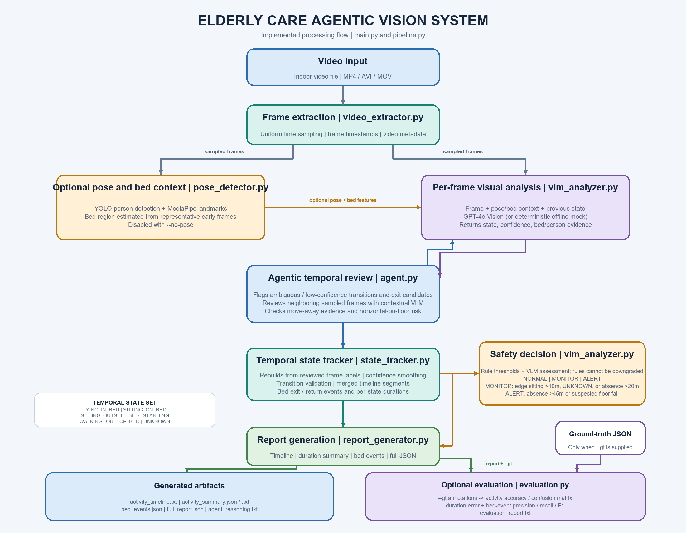

# Elderly Care Agentic Vision System

An end-to-end **Agentic AI + Vision** system that continuously monitors an elderly person in an indoor environment and provides:
- Real-time activity state classification
- Temporal state transition detection
- Bed exit and return event tracking
- Duration tracking per activity
- Contextual safety alerts (NORMAL / MONITOR / ALERT)

---

## Table of Contents
1. [Architecture](#architecture)
2. [System Components](#system-components)
3. [Activity States](#activity-states)
4. [Alert Logic](#alert-logic)
5. [Installation](#installation)
6. [Usage](#usage)
7. [Output Format](#output-format)
8. [Evaluation](#evaluation)
9. [Failure Cases](#failure-cases)
10. [Design Decisions](#design-decisions)

---

## Architecture



The pose branch and bed-region detection are optional (`--no-pose`). Agentic
review uses surrounding sampled frames to resolve ambiguous transitions and
bed-exit candidates; the tracker is then rebuilt from the reviewed analyses.
Ground-truth evaluation runs only when `--gt` is provided. See the detailed
[architecture diagram](./architecture.png).

---

## System Components

| File | Purpose |
|------|---------|
| `models.py` | Data models: ActivityState, FrameAnalysis, BedEvent, AnalysisReport |
| `video_extractor.py` | Frame extraction at a configurable uniform interval |
| `pose_detector.py` | YOLOv8 person detection + MediaPipe Pose landmark extraction |
| `vlm_analyzer.py` | GPT-4o Vision integration for state classification |
| `state_tracker.py` | Temporal smoothing, valid transitions, bed event detection |
| `agent.py` | Agentic reasoning engine for ambiguity resolution |
| `report_generator.py` | Output generation: timeline, summary, events, evaluation |
| `pipeline.py` | Main orchestrator coordinating all components |
| `evaluation.py` | Ground-truth duration, event, and timeline metrics |
| `scenario_evaluation.py` | Scripted temporal stress scenarios and failure reports |
| `main.py` | CLI entry point |
| `demo.py` | Demo with synthetic video generation |

---

## Activity States

The system recognizes the following states:

| State | Description |
|-------|-------------|
| `LYING_IN_BED` | Person horizontal on the bed |
| `SITTING_ON_BED` | Person sitting upright on the bed |
| `SITTING_OUTSIDE_BED` | Person sitting on a chair or other surface |
| `STANDING` | Person standing still |
| `WALKING` | Person moving around the room |
| `OUT_OF_BED` | Person clearly away from the bed |
| `UNKNOWN` | Insufficient evidence (occlusion, poor lighting, etc.) |

### State Transition Graph

```
LYING_IN_BED ──────→ SITTING_ON_BED ──────→ STANDING ──────→ WALKING
     ↑                      ↓                    ↓                ↓
     │               LYING_IN_BED        SITTING_OUTSIDE   OUT_OF_BED
     │                                        ↓                ↓
     └────────────────────────────────────────────────────────┘
                        (return to bed path)
```

Only physically plausible transitions are accepted. Implausible jumps
(e.g., `LYING_IN_BED → OUT_OF_BED` directly) require >0.85 confidence
to override the transition validator.

---

## Bed Exit / Return Logic

### Bed Exit Detection
```
LYING_IN_BED or SITTING_ON_BED
        ↓
    STANDING (candidate only; does not by itself confirm exit)
        ↓
    WALKING, SITTING_OUTSIDE_BED, or OUT_OF_BED
        ↓
    BED_EXIT event emitted
```

**False positive prevention:**
- Sitting up briefly does NOT count as a bed exit
- Standing briefly and returning to bed cancels the candidate
- A move-away state must follow the standing candidate
- Direct transitions to a move-away state are accepted when a sampled
  intermediate standing state is unavailable
- Agentic context review can revise frame labels; the temporal tracker is
  rebuilt from the revised labels before events and durations are reported

### Bed Return Detection
```
Confirmed out-of-bed state
        ↓
SITTING_ON_BED or LYING_IN_BED
        ↓
    BED_RETURN event emitted
```

---

## Alert Logic

The system produces one of three alert levels based on rules + VLM reasoning:

### NORMAL
- Routine activities: lying, sitting, standing, walking normally
- Bed exits followed by prompt return
- No safety concerns detected

### MONITOR
Triggered when:
- Person is classified as `SITTING_ON_BED` for **> 10 minutes**. This is a
  conservative proxy; the current detector cannot distinguish edge from
  middle-of-bed sitting.
- Current state is `UNKNOWN`, or accumulated `UNKNOWN` duration exceeds 30 seconds
- The longest confirmed out-of-bed period exceeds 20 minutes

### ALERT
Triggered when:
- Person is continuously **out of bed > 45 minutes**
- Agentic analysis detects a person lying on the floor (potential fall)

**Rule-based pre-screening** runs instantly (no API call) for fast alerting.
When the VLM responds, it may raise the severity but cannot downgrade a
rule-triggered `MONITOR` or `ALERT`.

---

## Installation

### Prerequisites
- Git
- Python 3.9+ (Python 3.10 or 3.11 recommended)
- An OpenAI API key with access to the selected vision model is required only
  for live analysis; mock mode works without a key.

### Windows PowerShell setup

Open PowerShell in the folder where you want the project, then run:

```powershell
git clone https://github.com/B4S1NDU7/Elderly-care-agentic-vision.git
Set-Location .\Elderly-care-agentic-vision

py -3.11 -m venv .venv
.\.venv\Scripts\python.exe -m pip install --upgrade pip
.\.venv\Scripts\python.exe -m pip install -r requirements.txt
```

Using the virtual-environment Python directly avoids PowerShell activation
policy issues. If `py -3.11` is unavailable, install Python 3.10 or 3.11 and
use the matching launcher, for example `py -3.10`.

### macOS / Linux setup

```bash
git clone https://github.com/B4S1NDU7/Elderly-care-agentic-vision.git
cd Elderly-care-agentic-vision
python3 -m venv .venv
source .venv/bin/activate
python -m pip install --upgrade pip
python -m pip install -r requirements.txt
```

---

## Usage

For a clean-clone setup guide with Windows, macOS/Linux, offline demo, live
video, evaluation, and test commands, see [RUN_INSTRUCTIONS.md](./RUN_INSTRUCTIONS.md).

### Basic Analysis

```bash
python main.py --video path/to/video.mp4
```

### With All Options

```bash
python main.py \
  --video input/room_footage.mp4 \
  --output results/ \
  --interval 2.0 \
  --model gpt-4o \
  --api-key sk-your-key
```

### With Ground Truth Evaluation

```bash
python main.py \
  --video input/room.mp4 \
  --gt ground_truth_template.json
```

### Demo (Synthetic Video)

This runs offline and needs no API key. From the repository root:

```bash
python demo.py --duration 60 --mock --interval 1 --output-dir demo_output
```

The demo creates `demo_video.mp4` and writes reports into `demo_output/`.
To evaluate the generated video against the matching bundled synthetic labels:

```bash
python main.py --video demo_video.mp4 --mock --interval 1 \
  --gt sample_output/synthetic_ground_truth.json \
  --output evaluation_output
```

On Windows, replace `python` with `.\.venv\Scripts\python.exe` in the commands
above and below.

### Analyze your own video with the live vision model

Create a local `.env` file from the template and add your key:

```powershell
Copy-Item .env.example .env
notepad .env
```

Set `OPENAI_API_KEY=your_key_here` in `.env`, save it, then run:

```powershell
.\.venv\Scripts\python.exe .\main.py `
  --video .\path\to\your_video.mp4 `
  --output .\output `
  --interval 2
```

The first pose-enabled run may download YOLO model weights if they are not
already available, so internet access may be needed. The `.env` file contains
a secret and must not be committed. Use `--mock` for offline testing; mock
results are not a substitute for real-video evaluation.

### Optional: run the notebook

Jupyter is not required for the CLI. To use the notebook, install JupyterLab
and start it from the repository root:

```powershell
.\.venv\Scripts\python.exe -m pip install jupyterlab
.\.venv\Scripts\python.exe -m jupyter lab
```

Open `demo.ipynb` in the browser and run its cells in order.

### CLI Options

| Option | Default | Description |
|--------|---------|-------------|
| `--video` | required | Path to input video |
| `--output` | `output/` | Output directory |
| `--interval` | `2.0` | Frame sampling interval (seconds) |
| `--model` | `gpt-4o` | OpenAI model (`gpt-4o`, `gpt-4o-mini`) |
| `--api-key` | env var | OpenAI API key |
| `--gt` | None | Ground truth JSON for evaluation |
| `--no-pose` | False | Disable pose estimation |
| `--no-agent` | False | Disable agentic resolution |
| `--max-frames` | None | Limit frames (for quick testing) |
| `--quiet` | False | Reduce logging |

---

## Output Format

All outputs are saved to the `output/` directory:

### `activity_timeline.txt`
```
00:00 – 11:42    LYING_IN_BED              (11m 42s) 🛏
11:42 – 13:50    SITTING_ON_BED            (2m 08s) 🛏
13:50 – 14:53    STANDING                  (1m 03s)
14:53 – 17:40    WALKING                   (2m 47s) 🚶
17:40 – 19:15    SITTING_OUTSIDE_BED       (1m 35s)
19:15 – 20:00    LYING_IN_BED              (45s) 🛏
```

### `activity_summary.json`
```json
{
  "total_observation_time": "20m 00s",
  "activity_summary": {
    "lying_in_bed": "11m 42s",
    "sitting_on_bed": "2m 08s",
    "sitting_outside_bed": "1m 35s",
    "standing": "1m 03s",
    "walking": "2m 47s",
    "unknown": "45s"
  },
  "bed_summary": {
    "time_in_bed": "13m 50s",
    "time_out_of_bed": "6m 10s",
    "bed_exit_count": 2,
    "bed_return_count": 2
  }
}
```

### `bed_events.json`
```json
{
  "bed_exit_count": 2,
  "events": [
    {
      "event": "bed_exit",
      "start_time": "00:05:08",
      "confirmed_time": "00:05:20",
      "previous_state": "sitting_on_bed",
      "current_state": "walking",
      "confidence": 0.92,
      "decision": "MONITOR"
    }
  ]
}
```

### `full_report.json`
Complete machine-readable report with all fields:
```json
{
  "observation_duration_sec": 1200,
  "activity_duration_sec": { ... },
  "bed_exit_count": 2,
  "bed_return_count": 2,
  "total_in_bed_sec": 830,
  "total_out_of_bed_sec": 370,
  "longest_out_of_bed_period_sec": 241,
  "final_state": "lying_in_bed",
  "final_alert": "NORMAL",
  "timeline": [ ... ],
  "bed_events": [ ... ]
}
```

### `agent_reasoning.txt`
Log of all agentic decisions:
```
AGENTIC REASONING LOG
==================================================

[1] Trigger: Ambiguous transition: sitting_on_bed → standing
    Action: Analyzed 6 context frames
    Finding: Person briefly stood to adjust blanket, returned immediately
    Conclusion: State remains SITTING_ON_BED (conf=0.82)
```

---

## Evaluation

### Running Evaluation

```bash
python main.py --video video.mp4 --gt ground_truth_template.json
```

With ground truth, the report calculates per-state duration error, activity
timeline accuracy, per-state accuracy, a confusion matrix, and tolerance-based
precision/recall/F1 for bed exits and returns. Event timestamps are matched
within 10 seconds by default; set `event_tolerance_sec` in the annotation file
to override this. Results are video-specific; this repository does not claim
benchmark accuracy.

`ground_truth_template.json` is a consistent illustrative annotation for
validating metric wiring. Replace it with manually annotated labels and event
times for the exact video being evaluated before treating metrics as evidence.

### Regression tests

```bash
python -m unittest discover -s tests -v
```

`sample_output/synthetic_ground_truth.json` provides labels for the
deterministic 60-second synthetic demo. The synthetic scene encodes its
activities with simple shapes/colors, so its evaluation validates pipeline
wiring only; it is not evidence of accuracy on real footage or the difficult
failure cases below.
The checked-in run reports 100% activity accuracy and 1/1 matched bed exits
and returns at the annotation's 3-second tolerance; these are synthetic-only
smoke-test results.

Run the deterministic temporal stress suite with:

```bash
python scenario_evaluation.py --output sample_output
```

It covers the assignment's difficult situations with ten scripted scenarios,
including turning while lying, sitting up, prolonged bed sitting, brief
standing without exit, bed exit/return, chair sitting, walking, blanket and
temporary occlusion, caregiver entry/identity confusion, poor lighting, and
camera-view loss. It also checks six NORMAL/MONITOR/ALERT rule conditions.
The latest run covers 821 seconds across the scenarios and reports 98.2%
weighted state accuracy, two false bed exits, and two false returns.
All six alert-rule checks pass. Observations are scripted state labels sent to
the tracker.
See [sample_output/challenging_case_evaluation.json](./sample_output/challenging_case_evaluation.json)
and [sample_output/failure_case_examples.md](./sample_output/failure_case_examples.md)
for per-case results.

To reproduce the annotated mock evaluation, generate the synthetic video and
run:

```bash
python demo.py --duration 60 --mock --interval 1 --output-dir sample_output
python main.py --video demo_video.mp4 --mock --interval 1 \
  --gt sample_output/synthetic_ground_truth.json --output sample_output
```

---

## Failure Cases

The system is designed to handle these difficult scenarios:

The scripted temporal stress report provides measured injected-label examples;
these are not real-video or image-model failure measurements:

1. **Caregiver during resident occlusion** (`caregiver_identity_switch`):
   injected `sitting_outside_bed` instead of `unknown` produced 75% state
   accuracy and one false bed exit plus one false return.
2. **Poor lighting** (`poor_lighting_forced_posture`): injected
   `lying_in_bed` instead of `unknown` produced 75% state accuracy and a
   5-second duration MAE.
3. **Temporary camera-view loss** (`camera_view_loss_false_absence`):
   injected `out_of_bed` instead of `unknown` produced 75% state accuracy
   and one false bed exit plus one false return.
4. **Brief standing adjustment** (`brief_stand_and_return`): the scripted
   stand-then-return sequence produced no false bed exit.

The scenarios show temporal handling consequences of supplied labels, not how
the image models classify those real visual conditions. Test against difficult,
manually labeled video before drawing conclusions about perception performance.

---

## Design Decisions

### Why GPT-4o Vision?
GPT-4o provides superior scene understanding, especially for edge cases like:
distinguishing bed vs. floor, recognizing partial occlusion, handling unusual camera angles.
Unlike specialized models, it requires no training data and generalizes well.

### Why YOLOv8 Pose?
The pose detector supplies local person and body-landmark features to complement
the VLM. No accuracy improvement is claimed without a labeled benchmark.

### Why Temporal Smoothing?
The tracker votes over a configurable frame window to reduce brief
classification fluctuations. The effect on accuracy and latency requires
measurement on labeled videos.

### Why an Agentic Engine?
Some transitions genuinely require temporal context — the same frame showing a person
standing next to a bed could be a bed exit OR the person just adjusting their position.
The agentic engine can ask the VLM to review contextual frames; its impact on
precision must be measured rather than assumed.

### Alert Thresholds
- **10 min classified sitting on bed**: Used as a conservative alerting proxy;
  edge-specific detection is not available in the current pose/state features.
- **45 min out of bed**: Prolonged absence suggests the person may need assistance
  but hasn't returned (possible fall, bathroom difficulty, etc.)
- These thresholds are implemented in the VLM analyzer's rule-based alert
function and should be tuned against the care setting before deployment.

---

## Project Structure

```
Elderly-care-agentic-vision/
├── main.py                    # CLI entry point
├── demo.py                    # Demo with synthetic video
├── demo.ipynb                 # Interactive demo
├── pipeline.py                # Main orchestrator
├── models.py                  # Data models & types
├── video_extractor.py         # Frame extraction
├── pose_detector.py           # YOLOv8 + MediaPipe
├── vlm_analyzer.py            # GPT-4o Vision
├── state_tracker.py           # Temporal state machine
├── agent.py                   # Agentic reasoning engine
├── report_generator.py        # Output generation
├── evaluation.py              # Metrics computation
├── scenario_evaluation.py    # Scripted temporal stress scenarios
├── RUN_INSTRUCTIONS.md       # Fresh-clone setup and run guide
├── requirements.txt           # Python dependencies
├── .env.example               # API key template
├── ground_truth_template.json # GT annotation format
├── architecture.png           # Architecture diagram
├── sample_output/              # Offline synthetic smoke-test reports
│   ├── synthetic_ground_truth.json
│   ├── activity_timeline.txt
│   ├── activity_summary.txt / activity_summary.json
│   ├── bed_events.json / full_report.json
│   ├── evaluation_report.txt
│   ├── agent_reasoning.txt
│   ├── challenging_case_evaluation.json
│   └── failure_case_examples.md
└── tests/                     # Tracker, evaluation, and stress-suite tests
└── output/                    # Generated reports (created at runtime)
    ├── activity_timeline.txt
    ├── activity_summary.txt
    ├── activity_summary.json
    ├── bed_events.json
    ├── full_report.json
    ├── evaluation_report.txt
    └── agent_reasoning.txt
```

---

## Notes for Interview

**Things I'd do differently with more time:**

1. **Person Re-ID**: Add a ReID model (e.g., OSNet) to track the specific elderly person
   across the video and ignore caregivers/visitors.

2. **Fine-tuned pose model**: Train a lightweight activity classifier on top of MediaPipe
   pose landmarks to reduce VLM API calls for common unambiguous states.

3. **Bed region learning**: Use the first 30 seconds of video to auto-learn the
   bed region instead of relying on YOLO's COCO bed class.

4. **Streaming support**: Adapt the pipeline for real-time RTSP camera streams
   with a sliding-window analysis and live alert dispatch.

5. **Confidence calibration**: Calibrate VLM confidence scores against held-out
   validation data for more reliable MONITOR/ALERT thresholds.

6. **Longitudinal tracking**: Track patterns over multiple days to detect
   behavioral changes (sleeping more, reduced activity) that indicate health decline.
